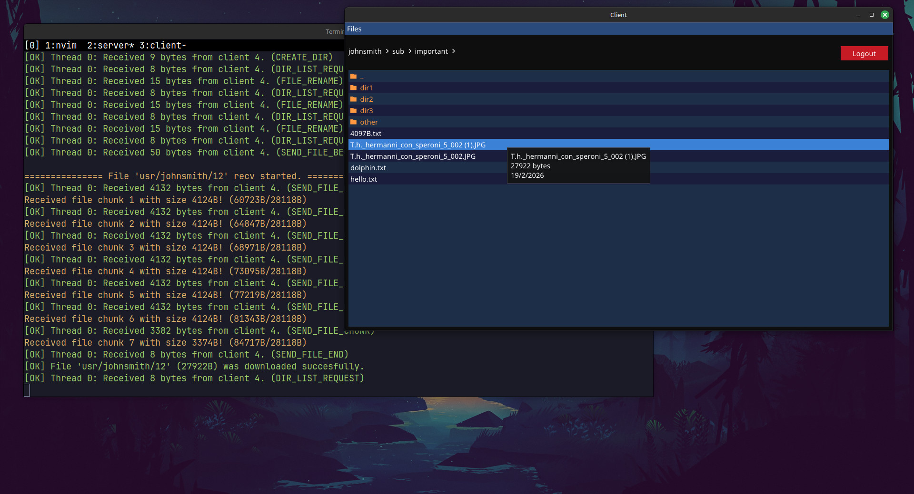
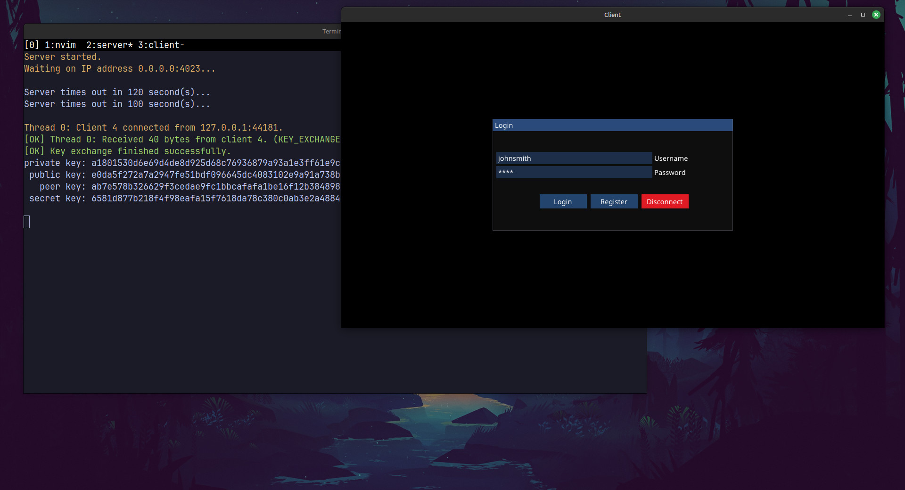
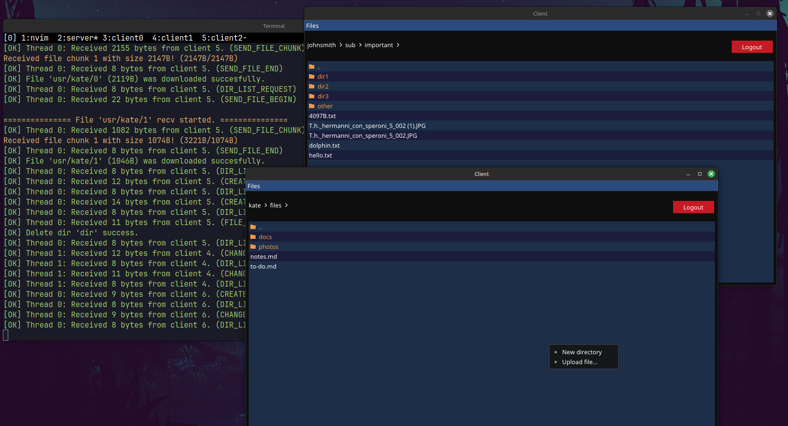

## POSIX Cloud Server

Secure client–server file storage system made in C++ that allows users to access encrypted files from multiple devices. The project focuses on secure communication, strong encryption, concurrency, and an easy to use graphical interface.

## Overview

- **Communication:** TCP/IP with a pre-threaded concurrent server model
- **Key Exchange:** Elliptic-curve Diffie–Hellman (ECDH)
- **File Encryption:** AES-GCM-256
- **Password Hashing:** scrypt with salt
- **Storage:** XML-based metadata; encrypted files stored on disk with unique IDs and backup copies
- **Security Model:** Encryption keys are derived from the user’s password — the server cannot access plaintext file contents.

## Tech Stack & Dependencies

- C++
- CMake
- SDL2
- Dear ImGui
- nativefiledialog-extended
- tinyxml2
- OpenSSL
- libsodium

## Examples

